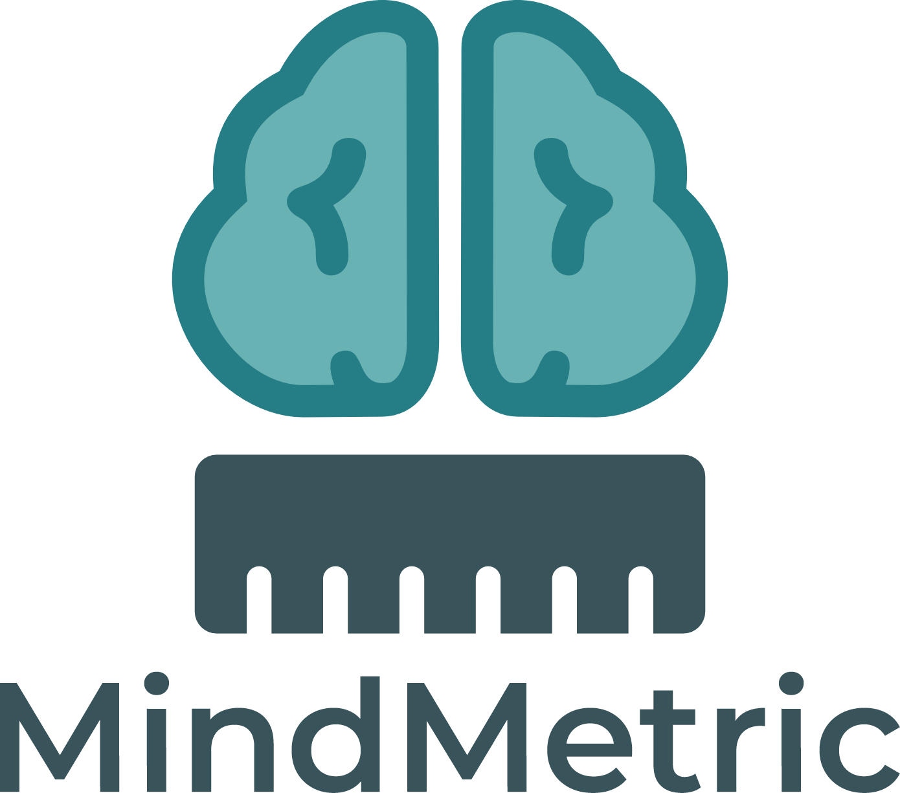

<div align="center">
  
</div>

<br>
<br>

<div align="center">
  <a href="#colaboradores">Participantes</a> •
  <a href="#pré-requisitos">Pré-requisitos</a> •
  <a href="#instalação">Instalação</a> •
  <a href="#rodando-o-projeto">Rodando o projeto</a> •
  <a href="#uso">Como usar</a> •
  <a href="#video">Vídeo demonstrativo</a>
</div>

<br>
<br>

> MindMetric é um app mobile em React Native que permite registrar atividades diárias e acompanhar a evolução profissional por meio de gráficos e métricas gerados localmente, facilitando a análise das competências mais desenvolvidas ao longo da semana.

<h2 id="colaboradores">🤝 Colaboradores</h2>

| Nome                             | RM      |
| -------------------------------- | ------- |
| Kenzo Schiavone Inoue dos Santos | RM99890 |
| Pedro Daniluz                    | RM97697 |

<h2 id="pré-requisitos">💻 Pré-requisitos</h2>

- [Node.js](https://nodejs.org/)
- [Expo CLI](https://docs.expo.dev/get-started/installation/)
- [Gerenciador de pacotes: [npm](https://docs.npmjs.com/downloading-and-installing-node-js-and-npm) ou [yarn](https://classic.yarnpkg.com/lang/en/docs/install/#windows-stable)

<h2 id="instalação">🚀 Instalação</h2>

Clone o repositório:

```bash
git clone https://github.com/PedroDaniluz/mind-metric.git
cd mind-metric
```

Instale as dependências:

```bash
npm install
# ou
yarn
```

<h2 id="rodando-o-projeto">☕ Rodando o Projeto</h2>

1. Instale o Expo CLI globalmente, se ainda não tiver:

   ```bash
   npm install -g expo-cli
   ```

2. Inicie o projeto:

   ```bash
   npx expo start
   ```

3. Use o aplicativo [Expo Go](https://expo.dev/client) no seu dispositivo móvel ou um emulador/simulador para visualizar o app.

4. Para criar e gerenciar emuladores Android (AVDs), consulte a [documentação oficial do Android Studio](https://developer.android.com/studio/run/managing-avds?authuser=1&hl=pt-br).

5. Para criar e gerenciar simuladores iOS, utilize o Xcode no macOS. Consulte a [documentação oficial da Apple](https://developer.apple.com/documentation/xcode/running-your-app-in-simulator-or-on-a-device).

> **Observação:** Certifique-se de que todas as dependências estejam instaladas e o ambiente configurado corretamente.

<h2 id="uso">🕹️ Como usar</h2>

Após iniciar o app, você terá acesso às seguintes funcionalidades principais:

- **Tela de Boas-vindas:**  
  Toque em "Iniciar" para acessar o Onboarding da aplicação.

- **Onboarding (Configuração Inicial):**
  - Escolha as competências que deseja acompanhar durante a semana.
  - Após selecionar, você será direcionado ao painel principal.

- **Dashboard (Home):**
  - Visualize seus indicadores semanais.
  - Veja a distribuição das competências trabalhadas através de gráficos (Radar/Donut).
  - Toque em **"Registrar atividade"** para adicionar uma nova atividade realizada no dia.

- **Registrar Atividade:**
  - Insira o título da atividade.
  - Defina a intensidade (0 a 3) de cada competência trabalhada.
  - Faça sua autoavaliação (1 a 5 estrelas).
  - Salve a atividade — ela aparecerá automaticamente no Dashboard e no histórico.

- **Histórico:**
  - Veja todas as atividades registradas.
  - Consulte competências, intensidades e datas.

> **Observação:** Todos os dados são armazenados localmente no dispositivo via AsyncStorage. Nenhuma informação é enviada para servidores externos.

<h2 id="video">🎥 Vídeo Demonstrativo</h2>
Confira abaixo um vídeo curto apresentando as principais funcionalidades do app em ação:

👉 [Clique aqui para assistir](https://youtu.be/S8fA5H90yDI)
